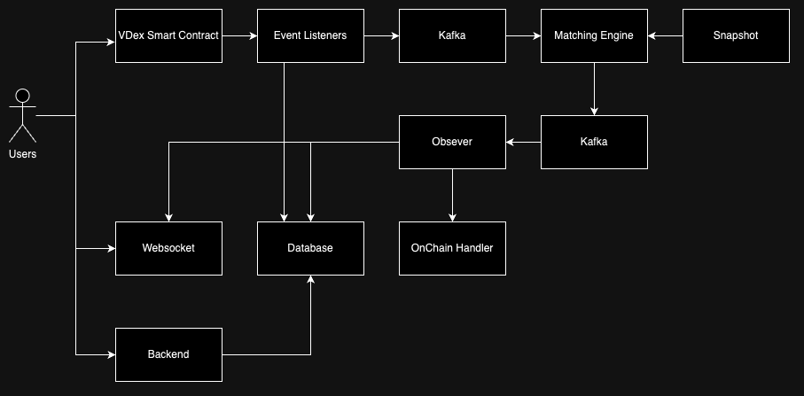

# VDEX

## Architecture



## Techstacks

- Golang
- Postgres
- Kafka
- Redis

## API Docs

### Endpoint:

### Auth

- POST: /v1/users/login

  - body:

    ```
    {
        "signature": "0x123",
        "address": "0x123"
    }
    ```

  - response:

    ```
    {
        code: 200,
        success: true,
        msg: "success",
        data:{
            "jwt": "jwt_token"
        }
    }
    ```

### OrderBook

- GET: v1/products/:productId/depths?limit=1000

  - response:

    ```
    {
        code: 200,
        success: true,
        msg: "success",
        data:{
            asks: [
                ["40000","28"],
                ["41000","30"],
            ],
            bids: [
                ["35000", "50"],
                ["34000", "40"],
            ]
        }
    }
    ```

- GET: v1/products/:productId/trades?limit=1000

  - response:

    ```
    {
        code: 200,
        success: true,
        msg: "success",
        data:[
            {
                "time": "2023-11-03T15:09:47+07:00",
                "tradeId": 21,
                "price": "25",
                "size": "0.1",
                "side": "buy"
            },
            {
                "time": "2023-11-03T10:08:21+07:00",
                "tradeId": 20,
                "price": "25",
                "size": "1",
                "side": "buy"
            },
            {
                "time": "2023-11-03T10:08:21+07:00",
                "tradeId": 20,
                "price": "25",
                "size": "1",
                "side": "sell"
            },
        ]
    }
    ```

- GET: v1/products/:productId/candles?granularity=60

  - response:

    - note:
      - [ time, low, high, open, close, volume ]
      - [ 1415398768, 0.32, 4.2, 0.35, 4.2, 12.3 ]

    ```
    {
        code: 200,
        success: true,
        msg: "success",
        data:[
                [1698998940, 25, 30, 25, 25, 0.1],
                [1698998880, 25, 24, 25, 25, 1],
                [1698998760, 25, 31, 25, 25, 1.5]
            ]
    }
    ```

- GET: v1/orders?productId=BTC-VIC&limit=30&statuses=open,filled&side=buy

  - Header:

    ```
    {
        "Authorization": "Bearer <TOKEN>"
    }
    ```

  - response:

    ```
    {
        code: 200,
        success: true,
        msg: "success",
        data:[
            {
                "id": "5820841",
                "price": "25",
                "size": "3",
                "funds": "65",
                "productId": "BTC-VIC",
                "side": "buy",
                "type": "limit",
                "createdAt": "2023-11-02T15:58:30+07:00",
                "fillFees": "0",
                "filledSize": "2.6",
                "executedValue": "65",
                "status": "open",
                "settled": false
            },
            {
                "id": "5820840",
                "price": "24",
                "size": "2",
                "funds": "0",
                "productId": "BTC-VIC",
                "side": "sell",
                "type": "limit",
                "createdAt": "2023-11-02T15:57:20+07:00",
                "fillFees": "0",
                "filledSize": "0",
                "executedValue": "0",
                "status": "open",
                "settled": false
            }
        ]
    }
    ```

- GET: v1/orders/filled?productId=BTC-VIC&limit=30

  - Header:

    ```
    {
        "Authorization": "Bearer <TOKEN>"
    }
    ```

  - response:

    ```
    {
        code: 200,
        success: true,
        msg: "success",
        data:[
            {
                "id": "5820841",
                "price": "25",
                "size": "3",
                "productId": "BTC-VIC",
                "side": "buy",
                "type": "limit",
                "createdAt": "2023-11-02T15:58:30+07:00",
                "fee": "0"
            },
            {
                "id": "5820841",
                "price": "25",
                "size": "4",
                "productId": "BTC-VIC",
                "side": "sell",
                "type": "limit",
                "createdAt": "2023-11-02T15:58:30+07:00",
                "fee": "0"
            },
        ]
    }
    ```

- DELETE: v1/orders/:orderId

  - Header:

    ```
    {
        "Authorization": "Bearer <TOKEN>"
    }
    ```

  - response:

    ```
    {
        code: 200,
        success: true,
        msg: "success",
        data: {
                "id": "5820841",
                "price": "25",
                "size": "3",
                "funds": "65",
                "productId": "BTC-USDT",
                "side": "buy",
                "type": "limit",
                "createdAt": "2023-11-02T15:58:30+07:00",
                "fillFees": "0",
                "filledSize": "2.6",
                "executedValue": "65",
                "status": "cancelling"
            }
    }
    ```

- DELETE: v1/orders

  - Header:

    ```
    {
        "Authorization": "Bearer <TOKEN>"
    }
    ```

  - response:

    ```
    {
        code: 200,
        success: true,
        msg: "success",
        data: [
            {
                "id": "5820841",
                "price": "25",
                "size": "3",
                "funds": "65",
                "productId": "BTC-USDT",
                "side": "buy",
                "type": "limit",
                "createdAt": "2023-11-02T15:58:30+07:00",
                "fillFees": "0",
                "filledSize": "2.6",
                "executedValue": "65",
                "status": "cancelling"
            }
        ]
    }
    ```

## Websocket Docs:

### Request:

- Subscribe

```js
{
    type: "subscribe"
    productIds: ["BNB-VIC"],
    channels: ["orderbook", "trade", "order"],
    token: <YOUR_JWT_TOKEN>
}
```

- Unsubscribe

```js
{
    type: "unsubscribe"
    productIds: ["BNB-VIC"],
    channels: ["orderbook", "trade", "order"],
    token: <YOUR_JWT_TOKEN>
}
```

### Response:

- Order Channel:

```js
{
    type:"order",
    data: {
        "id": "5820841",
        "price": "25",
        "size": "3",
        "funds": "65",
        "productId": "BTC-USDT",
        "side": "buy",
        "type": "limit",
        "createdAt": "2023-11-02T15:58:30+07:00",
        "fillFees": "0",
        "filledSize": "2.6",
        "executedValue": "65",
        "status": "cancelling"
    }
}
```

- Orderbook Channel:

```js
{
    type:"orderbook",
    data: ["asks","35000", "50"] // bids
}
```

- Trade Channel:

```js
{
    type:"trade",
    data: {
        "time": "2023-11-03T10:08:21+07:00",
        "tradeId": 20,
        "price": "25",
        "size": "1",
        "side": "buy"
    }
}
```
